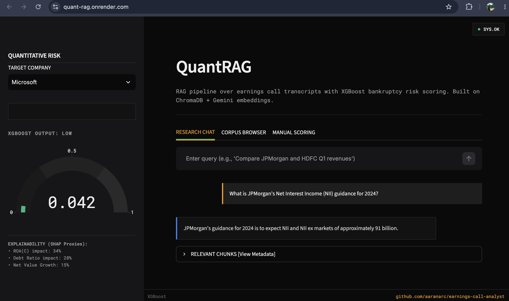

<div align="center">
  <h1>Quant RAG</h1>
  <p><strong>A production-grade, full-stack AI application designed to intelligently analyze corporate earnings calls and predict quantitative bankruptcy risks.</strong></p>
  
  [](#)
  [](#)
  [](#)
  [](#)
</div>

---

> **Live Demo:** (https://quant-rag.onrender.com)



---

## 🌟 Key Features

1. **Lightning-Fast Cloud RAG Pipeline**
   - Built with a serverless **Google Gemini** architecture (`gemini-flash-latest` & `gemini-embedding-2`) to entirely offload heavy machine learning processes from the local server.
   - Utilizes `ChromaDB` for ultra-fast semantic retrieval.
   - Guaranteed **Zero-RAM bottlenecks**, easily deployable on restricted free-tier cloud platforms.

2. **Live Quantitative Risk Engine**
   - Integrates a pre-trained **XGBoost** model initially developed for predicting Taiwanese bankruptcy.
   - Fetches live financial ratios directly via the `yfinance` API.
   - Computes real-time dynamic risk tiers based on live market data, mathematically combining it with historical baseline clustering.

3. **Premium UI/UX Architecture**
   - **Frontend:** Built with Streamlit and heavily customized with vanilla CSS, featuring glassmorphism, dynamic gradient meshes, and Plotly interactive gauges.
   - **Backend:** A scalable `FastAPI` REST architecture cleanly separating the AI logic from the presentation layer.

---

## 🛠 Tech Stack
- **AI/LLM:** Google Gemini (`gemini-flash-latest`)
- **Embeddings:** Google Gemini Embeddings
- **Vector Database:** ChromaDB
- **Machine Learning:** XGBoost, Scikit-learn, Pandas
- **Backend/API:** FastAPI, Uvicorn, Python 3.11
- **Frontend:** Streamlit, Plotly, Custom CSS

---

## 🚀 Getting Started Locally

### 1. Prerequisites
- Docker & Docker Compose
- A free [Google Gemini API Key](https://aistudio.google.com/app/apikey)

### 2. Installation
```bash
git clone https://github.com/YOUR_USERNAME/earnings-call-analyst.git
cd earnings-call-analyst
```

Create a `.env` file in the root directory:
```env
GEMINI_API_KEY=your_gemini_api_key_here
```

### 3. Run the System
```bash
docker-compose up --build
```
- **Streamlit Frontend:** `http://localhost:8501`
- **FastAPI Backend:** `http://localhost:8000`

---

## ☁️ Cloud Deployment (Render.com)

This project is fully containerized and production-ready for Render's free tier.
1. Connect this GitHub repo to [Render.com](https://render.com/).
2. Deploy via the included **Blueprint** (`render.yaml`).
3. Add your `GEMINI_API_KEY` to the `aarana-fastapi-backend` environment variables in the Render dashboard.

---

*Designed and engineered as a comprehensive demonstration of applied AI in finance.*
